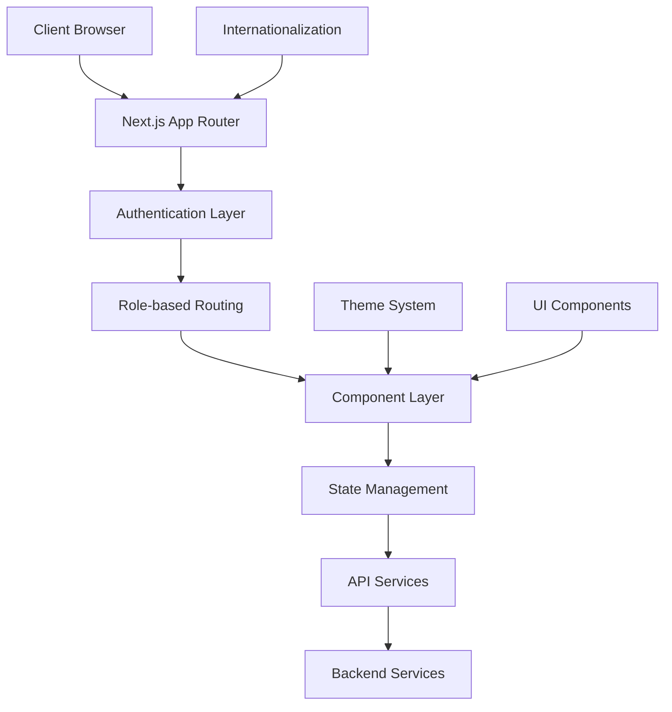
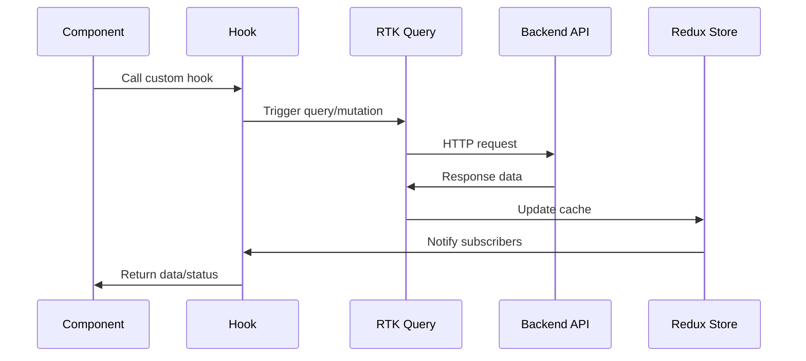
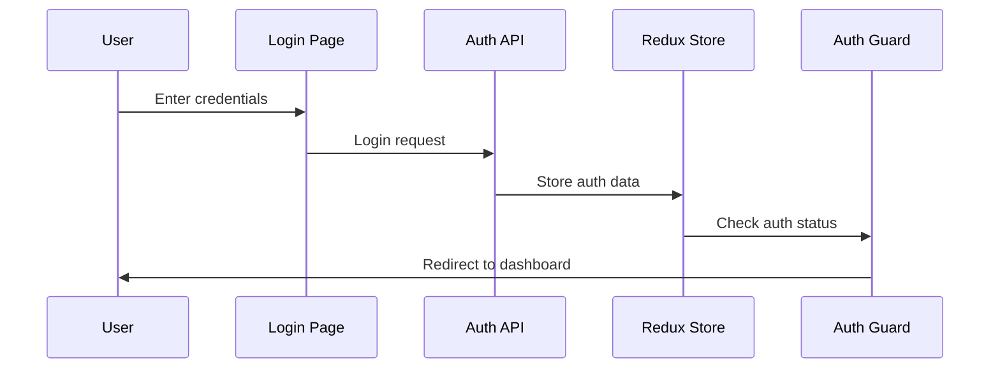

# Architecture Documentation

## 📋 Table of Contents
- [System Overview](#system-overview)
- [Frontend Architecture](#frontend-architecture)
- [State Management](#state-management)
- [Routing Strategy](#routing-strategy)
- [Component Architecture](#component-architecture)
- [Data Flow](#data-flow)
- [Authentication Flow](#authentication-flow)
- [Internationalization Architecture](#internationalization-architecture)
- [Performance Optimizations](#performance-optimizations)
- [Security Architecture](#security-architecture)

## 🏗️ System Overview

TaskFlow follows a modern, scalable architecture built on Next.js 15 with the App Router, implementing a clean separation of concerns and modular design patterns.

### High-Level Architecture



### Core Principles

1. **Separation of Concerns**: Clear boundaries between UI, business logic, and data
2. **Type Safety**: Full TypeScript implementation across all layers
3. **Modularity**: Reusable components and services
4. **Performance**: Optimized rendering and data fetching
5. **Accessibility**: WCAG compliant design
6. **Internationalization**: Built-in i18n support

## 🎯 Frontend Architecture

### Layer Structure

```
┌─────────────────────────────────────┐
│           Presentation Layer        │
│  ┌─────────────┐ ┌─────────────────┐│
│  │   Pages     │ │   Components    ││
│  │  (App Dir)  │ │   (Shadcn/UI)   ││
│  └─────────────┘ └─────────────────┘│
└─────────────────────────────────────┘
┌─────────────────────────────────────┐
│            Business Layer           │
│  ┌─────────────┐ ┌─────────────────┐│
│  │    Hooks    │ │   State Mgmt    ││
│  │  (Custom)   │ │ (Redux Toolkit) ││
│  └─────────────┘ └─────────────────┘│
└─────────────────────────────────────┘
┌─────────────────────────────────────┐
│             Data Layer              │
│  ┌─────────────┐ ┌─────────────────┐│
│  │ RTK Query   │ │   API Services  ││
│  │ (Caching)   │ │  (HTTP Client)  ││
│  └─────────────┘ └─────────────────┘│
└─────────────────────────────────────┘
```

### Technology Stack

#### Core Framework
- **Next.js 15**: React framework with App Router
- **React 19**: Latest React with concurrent features
- **TypeScript 5**: Full type safety

#### Styling & UI
- **Tailwind CSS 4.1.11**: Utility-first CSS framework
- **Radix UI**: Unstyled, accessible UI primitives
- **shadcn/ui**: Pre-built component library
- **Framer Motion**: Animation library
- **Lucide React**: Icon library

#### State Management
- **Redux Toolkit**: Modern Redux with less boilerplate
- **RTK Query**: Data fetching and caching
- **Redux Persist**: State persistence

#### Internationalization
- **next-intl**: Next.js internationalization
- **Custom i18n utilities**: RTL/LTR support

## 🗄️ State Management

### Store Configuration

```typescript
// store/index.ts
export const store = configureStore({
  reducer: {
    // API slices
    [authApi.reducerPath]: authApi.reducer,
    [studentApi.reducerPath]: studentApi.reducer,
    [adminApi.reducerPath]: adminApi.reducer,
    [collegeApi.reducerPath]: collegeApi.reducer,
    [departmentApi.reducerPath]: departmentApi.reducer,
    [teacherApi.reducerPath]: teacherApi.reducer,
    
    // State slices
    auth: persistedAuthReducer,
    user: persistedUserReducer,
  },
  middleware: (getDefaultMiddleware) =>
    getDefaultMiddleware({
      serializableCheck: {
        ignoredActions: [FLUSH, REHYDRATE, PAUSE, PERSIST, PURGE, REGISTER],
      },
    })
    .concat(authApi.middleware)
    .concat(studentApi.middleware)
    .concat(adminApi.middleware)
    .concat(collegeApi.middleware)
    .concat(departmentApi.middleware)
    .concat(teacherApi.middleware),
})
```

### State Structure

```typescript
interface RootState {
  // Authentication state
  auth: {
    id: string | null;
    mongoId: string | null;
    role: Role | null;
  };
  
  // User profile state
  user: {
    name: string | null;
    email: string | null;
  };
  
  // API cache states (managed by RTK Query)
  authApi: ApiSliceState;
  studentApi: ApiSliceState;
  adminApi: ApiSliceState;
  collegeApi: ApiSliceState;
  departmentApi: ApiSliceState;
  teacherApi: ApiSliceState;
}
```

### RTK Query Services

Each API service follows a consistent pattern:

```typescript
// Example: authApi.ts
export const authApi = createApi({
  reducerPath: 'authApi',
  baseQuery: baseQueryWithErrorHandling(
    process.env.NEXT_PUBLIC_API_URL_AUTH || 'http://localhost:5000'
  ),
  endpoints: (builder) => ({
    getMe: builder.query<AuthResponse, void>({
      query: () => ({
        url: '/auth',
        suppress401: true,
      }),
    }),
    login: builder.mutation<LoginResponse, LoginRequest>({
      query: (credentials) => ({
        url: '/auth/login',
        method: 'POST',
        body: credentials,
      }),
    }),
    logout: builder.mutation<void, void>({
      query: () => ({
        url: '/auth/logout',
        method: 'POST',
      }),
    }),
  }),
});
```

## 🛣️ Routing Strategy

### App Router Structure

```
app/
├── layout.tsx                    # Root layout with providers
├── page.tsx                      # Landing page
├── landing.tsx                   # Landing page component
├── (user)/                       # Protected routes group
│   ├── layout.tsx               # User layout with auth guard
│   ├── [role]/                  # Dynamic role-based routing
│   │   └── [id]/
│   │       └── settings/
│   │           └── page.tsx     # Settings page
│   ├── admin/                   # Admin-specific routes
│   │   └── [id]/
│   │       ├── page.tsx         # Admin dashboard
│   │       ├── colleges/        # College management
│   │       ├── courses/         # Course management
│   │       ├── departments/     # Department management
│   │       ├── students/        # Student management
│   │       └── teachers/        # Teacher management
│   ├── student/                 # Student-specific routes
│   │   └── [id]/
│   │       ├── layout.tsx       # Student layout
│   │       ├── page.tsx         # Student dashboard
│   │       ├── assignment/      # Assignments
│   │       ├── calendar/        # Calendar view
│   │       ├── courses/         # Enrolled courses
│   │       └── grades/          # Grade view
│   ├── teacher/                 # Teacher-specific routes
│   │   └── [id]/
│   │       └── page.tsx         # Teacher dashboard
│   └── super-admin/             # Super admin routes
│       └── [id]/
│           ├── page.tsx         # Super admin dashboard
│           ├── colleges/
│           ├── courses/
│           ├── departments/
│           ├── students/
│           └── teachers/
├── auth/                        # Authentication routes
│   └── login/
│       ├── layout.tsx           # Auth layout
│       └── page.tsx             # Login page
├── mock/                        # Development mock data
│   └── stats.ts
└── protected-redirect/          # Redirect handler
    └── page.tsx
```

### Route Protection

```typescript
// (user)/layout.tsx
export default function UserLayout({ children }: { children: React.ReactNode }) {
  return (
    <UserAuthGuard>
      <div className="min-h-screen bg-background">
        <Navbar />
        <main className="pt-16">
          {children}
        </main>
      </div>
    </UserAuthGuard>
  );
}
```

### Dynamic Role-based Routing

The application uses dynamic routing to handle different user roles:

```typescript
// Role-based redirect utility
export function getRoleBasedPath(role: string, id: string): string {
  const roleMap = {
    'student': `/student/${id}`,
    'teacher': `/teacher/${id}`,
    'admin': `/admin/${id}`,
    'super-admin': `/super-admin/${id}`,
  };
  
  return roleMap[role] || '/';
}
```

## 🧩 Component Architecture

### Component Hierarchy

```
Components/
├── ui/                          # Base UI components (shadcn/ui)
│   ├── button.tsx              # Button component
│   ├── card.tsx                # Card component
│   ├── input.tsx               # Input component
│   ├── select.tsx              # Select component
│   └── ...                     # Other UI primitives
├── layout/                      # Layout components
│   ├── Navbar.tsx              # Navigation bar
│   ├── SideMenu.tsx            # Side navigation
│   └── LocaleWrapper.tsx       # Language wrapper
├── auth/                        # Authentication components
│   ├── UserAuthGuard.tsx       # Route protection
│   ├── LogoutBtn.tsx           # Logout button
│   └── Unauthorized.tsx        # Unauthorized page
├── dashboard/                   # Dashboard components
│   ├── AdminDashboard.tsx      # Admin dashboard
│   ├── StatCard.tsx            # Statistics card
│   ├── RevenueChart.tsx        # Revenue chart
│   └── HeatmapGrid.tsx         # Activity heatmap
├── landing/                     # Landing page components
│   ├── Header.tsx              # Landing header
│   ├── HeroSection.tsx         # Hero section
│   ├── Features.tsx            # Features section
│   └── Footer.tsx              # Landing footer
├── tables/                      # Table components
│   ├── PaginatedTable.tsx      # Paginated table
│   ├── FormModal.tsx           # Form modal
│   └── DeleteModal.tsx         # Delete confirmation
└── made/                        # Custom utility components
    ├── language-switcher.tsx   # Language switcher
    └── responsive-validator.tsx # Responsive helper
```

### Component Design Patterns

#### 1. Compound Components
```typescript
// Card component with sub-components
export function Card({ children, className, ...props }) {
  return (
    <div className={cn("card-base", className)} {...props}>
      {children}
    </div>
  );
}

Card.Header = CardHeader;
Card.Content = CardContent;
Card.Footer = CardFooter;
```

#### 2. Render Props Pattern
```typescript
// Table component with render props
interface TableProps<T> {
  data: T[];
  renderRow: (item: T, index: number) => React.ReactNode;
  renderHeader: () => React.ReactNode;
}
```

#### 3. Higher-Order Component Pattern
```typescript
// Authentication HOC
export function withAuth<P extends object>(
  Component: React.ComponentType<P>
) {
  return function AuthenticatedComponent(props: P) {
    const { isLoggedIn } = useAuth();
    
    if (!isLoggedIn) {
      return <Unauthorized />;
    }
    
    return <Component {...props} />;
  };
}
```

## 🔄 Data Flow

### Request Flow



### Authentication Flow



### State Update Flow

```typescript
// Example: Login flow
const handleLogin = async (credentials: LoginCredentials) => {
  try {
    // 1. Call login mutation
    const result = await loginMutation(credentials).unwrap();
    
    // 2. Update Redux state
    dispatch(setAuth({
      id: result.data.id,
      mongoId: result.data._id,
      role: result.role
    }));
    
    // 3. Update user profile
    dispatch(setUser({
      name: result.data.name,
      email: result.data.email
    }));
    
    // 4. Redirect based on role
    const redirectPath = getRoleBasedPath(result.role, result.data.id);
    router.push(redirectPath);
    
  } catch (error) {
    // Handle error
    toast.error('Login failed');
  }
};
```

## 🔐 Authentication Flow

### Authentication Architecture

```typescript
// Authentication hook
export const useAuth = () => {
  const { data, isLoading, isError } = useGetMeQuery();

  return {
    user: data?.data,
    isLoading,
    isError,
    isLoggedIn: !!data,
    role: data?.data?.role,
    id: data?.data?.id,
    mongoId: data?.data?._id,
  };
};
```

### Route Protection

```typescript
// UserAuthGuard component
export default function UserAuthGuard({ children }: { children: ReactNode }) {
  const { role } = useAuth();

  if (!role) {
    return <Unauthorized />;
  }

  return <>{children}</>;
}
```

### Session Management

- **HTTP-only Cookies**: Secure session storage
- **Automatic Token Refresh**: Handled by RTK Query
- **Role-based Access**: Component-level protection
- **Logout Handling**: Clear state and redirect

## 🌍 Internationalization Architecture

### i18n System Design

```typescript
// lib/i18n.ts - Core i18n utilities
export const locales = ['en', 'ar'] as const;
export type Locale = typeof locales[number];

export const localeInfo = {
  en: {
    name: 'English',
    direction: 'ltr' as const,
    flag: '🇺🇸',
  },
  ar: {
    name: 'العربية',
    direction: 'rtl' as const,
    flag: '🇸🇦',
  },
};
```

### Language Switching Hook

```typescript
// hooks/useLanguage.ts
export function useLanguage() {
  const [currentLocale, setCurrentLocale] = useState<Locale>(() => getCurrentLocale());
  const [isPending, startTransition] = useTransition();

  const switchLanguage = (newLocale: string) => {
    if (!isValidLocale(newLocale) || newLocale === currentLocale) return;

    startTransition(() => {
      setLocale(newLocale);
      setCurrentLocale(newLocale);
      
      setTimeout(() => {
        window.location.reload();
      }, 100);
    });
  };

  return {
    locale: currentLocale,
    switchLanguage,
    availableLocales,
    currentLocaleInfo,
    isPending,
    isRTL: currentLocale === 'ar'
  };
}
```

### RTL/LTR Layout Support

```typescript
// Tailwind configuration for RTL support
function ({ addUtilities, addVariant }) {
  addVariant('rtl', '[dir="rtl"] &')
  addVariant('ltr', '[dir="ltr"] &')
  
  const newUtilities = {
    '.text-start': { 'text-align': 'start' },
    '.text-end': { 'text-align': 'end' },
    '.ms-auto': { 'margin-inline-start': 'auto' },
    '.me-auto': { 'margin-inline-end': 'auto' },
  }
  addUtilities(newUtilities)
}
```

## ⚡ Performance Optimizations

### Code Splitting
- **Automatic Route Splitting**: Next.js App Router
- **Component Lazy Loading**: React.lazy for heavy components
- **Dynamic Imports**: For non-critical features

### Caching Strategy
- **RTK Query Caching**: Automatic API response caching
- **Redux Persist**: State persistence across sessions
- **Next.js Caching**: Static and dynamic content caching

### Bundle Optimization
- **Tree Shaking**: Remove unused code
- **Image Optimization**: Next.js Image component
- **Font Optimization**: Preload critical fonts

### Rendering Optimization
- **Server Components**: Reduce client-side JavaScript
- **Streaming**: Progressive page loading
- **Suspense Boundaries**: Graceful loading states

## 🔒 Security Architecture

### Authentication Security
- **HTTP-only Cookies**: Prevent XSS attacks
- **CSRF Protection**: Built-in Next.js protection
- **Secure Headers**: Security headers configuration

### Data Validation
- **Zod Schemas**: Runtime type validation
- **Form Validation**: Client and server-side validation
- **API Input Sanitization**: Prevent injection attacks

### Access Control
- **Role-based Permissions**: Component-level access control
- **Route Protection**: Authentication guards
- **API Authorization**: Backend permission checks

This architecture ensures a scalable, maintainable, and secure educational management system that can grow with organizational needs while providing an excellent user experience across all supported languages and devices.