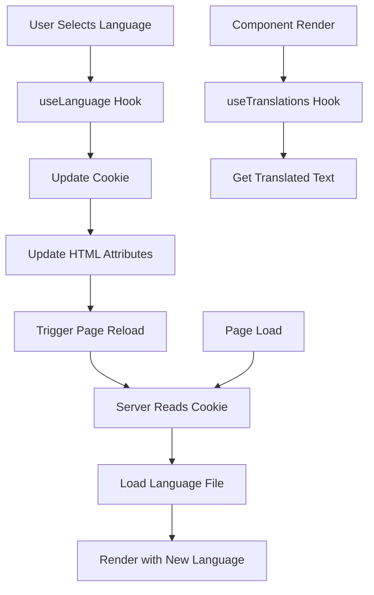

# Internationalization Guide

## 📋 Table of Contents
- [Overview](#overview)
- [Architecture](#architecture)
- [Configuration](#configuration)
- [Language Files](#language-files)
- [RTL/LTR Support](#rtlltr-support)
- [Usage Examples](#usage-examples)
- [Language Switching](#language-switching)
- [Best Practices](#best-practices)
- [Troubleshooting](#troubleshooting)

## 🌍 Overview

TaskFlow implements comprehensive internationalization (i18n) support using next-intl, providing seamless bilingual functionality for English and Arabic languages with full RTL/LTR layout support.

### Key Features
- **Bilingual Support**: English (LTR) and Arabic (RTL)
- **Dynamic Language Switching**: Real-time language changes without page reload
- **RTL/LTR Layouts**: Automatic layout direction switching
- **Server-side Rendering**: SEO-friendly internationalized content
- **Type Safety**: Full TypeScript support for translations
- **Persistent Preferences**: Language preference stored in cookies
- **Fallback System**: Graceful fallback to default language

### Supported Languages
- **English (en)**: Left-to-right (LTR) - Default language
- **Arabic (ar)**: Right-to-left (RTL) - Secondary language

## 🏗️ Architecture

### i18n System Components

```
Internationalization System
├── Core Configuration
│   ├── lib/i18n.ts              # Core i18n utilities
│   ├── i18n/request.ts          # Next-intl configuration
│   └── next.config.ts           # Next.js i18n setup
├── Language Files
│   ├── locales/en.json          # English translations
│   └── locales/ar.json          # Arabic translations
├── Hooks & Utilities
│   ├── hooks/useLanguage.ts     # Language switching hook
│   └── components/made/language-switcher.tsx
└── Layout Support
    ├── RTL/LTR CSS utilities
    └── Direction-aware components
```

### Data Flow



## ⚙️ Configuration

### Core i18n Configuration

**Location**: `src/lib/i18n.ts`

```typescript
// Supported locales configuration
export const locales = ['en', 'ar'] as const;
export type Locale = typeof locales[number];

// Default locale
export const DEFAULT_LOCALE: Locale = 'en';

// Cookie configuration
export const LANGUAGE_COOKIE = {
    name: 'lang',
    maxAge: 365 * 24 * 60 * 60, // 1 year in seconds
    httpOnly: false, // Accessible to client-side JavaScript
    secure: process.env.NODE_ENV === 'production',
    sameSite: 'lax' as const,
    path: '/',
} as const;

// Locale information with metadata
export const localeInfo = {
    en: {
        name: 'English',
        direction: 'ltr' as const,
        flag: '🇺🇸',
    },
    ar: {
        name: 'العربية',
        direction: 'rtl' as const,
        flag: '🇸🇦',
    },
} as const;

// Validation functions
export function isValidLocale(locale: string): locale is Locale {
    return locales.includes(locale as Locale);
}

export function getDefaultLocale(): Locale {
    return DEFAULT_LOCALE;
}

export function getSupportedLocales(): readonly Locale[] {
    return locales;
}
```

### Next.js Configuration

**Location**: `next.config.ts`

```typescript
import type { NextConfig } from "next";
import createNextIntlPlugin from 'next-intl/plugin';

const withNextIntl = createNextIntlPlugin('./src/i18n/request.ts');

const nextConfig: NextConfig = {
  async rewrites() {
    return [
      {
        source: '/login',
        destination: '/auth/login',
      },
    ]
  },
};

export default withNextIntl(nextConfig);
```

### next-intl Request Configuration

**Location**: `src/i18n/request.ts`

```typescript
import { getRequestConfig } from 'next-intl/server';
import { getServerLocale } from '@/lib/i18n';

export default getRequestConfig(async () => {
  // Get locale from server-side cookie
  const locale = await getServerLocale();

  return {
    locale,
    messages: (await import(`../../locales/${locale}.json`)).default,
    timeZone: 'UTC',
    now: new Date(),
    formats: {
      dateTime: {
        short: {
          day: 'numeric',
          month: 'short',
          year: 'numeric'
        }
      },
      number: {
        precise: {
          maximumFractionDigits: 5
        }
      }
    }
  };
});
```

### Root Layout Integration

**Location**: `src/app/layout.tsx`

```typescript
import { NextIntlClientProvider } from 'next-intl';
import { getServerLocale, getLocaleDirection, type Locale } from '@/lib/i18n';

export default async function RootLayout({
  children,
}: {
  children: React.ReactNode;
}) {
  // Read language from cookies using the centralized i18n utility
  const locale: Locale = await getServerLocale();

  // Get locale direction for HTML dir attribute
  const direction = getLocaleDirection(locale);

  // Load messages based on cookie-determined locale with error handling
  let messages;
  try {
    messages = (await import(`../../locales/${locale}.json`)).default;
  } catch (error) {
    console.warn(`Failed to load messages for locale ${locale}, falling back to English:`, error);
    // Fallback to English messages if locale-specific messages fail to load
    messages = (await import(`../../locales/en.json`)).default;
  }

  return (
    <html
      lang={locale}
      dir={direction}
      suppressHydrationWarning
    >
      <body className="antialiased">
        <ThemeProvider
          attribute="class"
          defaultTheme="system"
          enableSystem
          disableTransitionOnChange
        >
          <ReduxProvider>
            <NextIntlClientProvider locale={locale} messages={messages}>
              {children}
            </NextIntlClientProvider>
          </ReduxProvider>
        </ThemeProvider>
        <Toaster richColors position="bottom-left" closeButton />
      </body>
    </html>
  );
}
```

## 📄 Language Files

### English Translations

**Location**: `locales/en.json`

```json
{
  "Landing": {
    "Header": {
      "logo": {
        "taskflow": "Taskflow"
      },
      "nav": {
        "features": "Features",
        "benefits": "Benefits",
        "pricing": "Pricing",
        "about": "About",
        "contact": "Contact"
      },
      "cta": {
        "login": "Login",
        "getStarted": "Get Started",
        "signUp": "Sign Up"
      }
    },
    "Hero": {
      "title": "Transform Your Team's Productivity",
      "subtitle": "with TaskFlow",
      "description": "The ultimate task management platform that helps teams collaborate, track progress, and deliver projects on time. Join thousands of teams already boosting their productivity.",
      "cta": {
        "primary": "Start Free Trial",
        "secondary": "Watch Demo",
        "pricing": "View Pricing"
      },
      "stats": {
        "teams": "10K+ Teams",
        "tasks": "1M+ Tasks Completed",
        "rating": "4.9/5 Rating",
        "countries": "50+ Countries"
      }
    }
  },
  "navbar": {
    "brand": "TaskFlow",
    "portal": "Educational Portal",
    "profile": "Profile",
    "settings": "Settings",
    "logout": "Logout"
  },
  "dashboard": {
    "welcome": "Welcome back",
    "overview": "Dashboard Overview",
    "stats": {
      "totalStudents": "Total Students",
      "totalTeachers": "Total Teachers",
      "totalCourses": "Total Courses",
      "activeSessions": "Active Sessions"
    }
  },
  "forms": {
    "validation": {
      "required": "This field is required",
      "email": "Please enter a valid email address",
      "minLength": "Minimum {count} characters required",
      "maxLength": "Maximum {count} characters allowed"
    },
    "buttons": {
      "save": "Save",
      "cancel": "Cancel",
      "delete": "Delete",
      "edit": "Edit",
      "create": "Create",
      "update": "Update"
    }
  },
  "common": {
    "loading": "Loading...",
    "error": "An error occurred",
    "success": "Operation completed successfully",
    "noData": "No data available",
    "search": "Search...",
    "filter": "Filter",
    "sort": "Sort",
    "actions": "Actions"
  }
}
```

### Arabic Translations

**Location**: `locales/ar.json`

```json
{
  "Landing": {
    "Header": {
      "logo": {
        "taskflow": "تاسك فلو"
      },
      "nav": {
        "features": "المميزات",
        "benefits": "الفوائد",
        "pricing": "الأسعار",
        "about": "من نحن",
        "contact": "اتصل بنا"
      },
      "cta": {
        "login": "تسجيل الدخول",
        "getStarted": "ابدأ الآن",
        "signUp": "إنشاء حساب"
      }
    },
    "Hero": {
      "title": "حوّل إنتاجية فريقك",
      "subtitle": "مع تاسك فلو",
      "description": "منصة إدارة المهام المثالية التي تساعد الفرق على التعاون وتتبع التقدم وتسليم المشاريع في الوقت المحدد. انضم إلى آلاف الفرق التي تعزز إنتاجيتها بالفعل.",
      "cta": {
        "primary": "ابدأ النسخة التجريبية",
        "secondary": "شاهد العرض التوضيحي",
        "pricing": "عرض الأسعار"
      },
      "stats": {
        "teams": "أكثر من 10 آلاف فريق",
        "tasks": "أكثر من مليون مهمة مكتملة",
        "rating": "تقييم 4.9/5",
        "countries": "أكثر من 50 دولة"
      }
    }
  },
  "navbar": {
    "brand": "تاسك فلو",
    "portal": "البوابة التعليمية",
    "profile": "الملف الشخصي",
    "settings": "الإعدادات",
    "logout": "تسجيل الخروج"
  },
  "dashboard": {
    "welcome": "مرحباً بعودتك",
    "overview": "نظرة عامة على لوحة التحكم",
    "stats": {
      "totalStudents": "إجمالي الطلاب",
      "totalTeachers": "إجمالي المعلمين",
      "totalCourses": "إجمالي الدورات",
      "activeSessions": "الجلسات النشطة"
    }
  },
  "forms": {
    "validation": {
      "required": "هذا الحقل مطلوب",
      "email": "يرجى إدخال عنوان بريد إلكتروني صحيح",
      "minLength": "الحد الأدنى {count} أحرف مطلوب",
      "maxLength": "الحد الأقصى {count} أحرف مسموح"
    },
    "buttons": {
      "save": "حفظ",
      "cancel": "إلغاء",
      "delete": "حذف",
      "edit": "تعديل",
      "create": "إنشاء",
      "update": "تحديث"
    }
  },
  "common": {
    "loading": "جاري التحميل...",
    "error": "حدث خطأ",
    "success": "تمت العملية بنجاح",
    "noData": "لا توجد بيانات متاحة",
    "search": "بحث...",
    "filter": "تصفية",
    "sort": "ترتيب",
    "actions": "الإجراءات"
  }
}
```

## 🔄 RTL/LTR Support

### CSS Configuration

**Location**: `tailwind.config.ts`

```typescript
// RTL support plugin
function ({ addUtilities, addVariant }) {
  // Add RTL/LTR variants
  addVariant('rtl', '[dir="rtl"] &')
  addVariant('ltr', '[dir="ltr"] &')
  
  // Add logical properties utilities
  const newUtilities = {
    '.rtl-grid': { 'direction': 'rtl' },
    '.ltr-grid': { 'direction': 'ltr' },
    '.text-start': { 'text-align': 'start' },
    '.text-end': { 'text-align': 'end' },
    '.ms-auto': { 'margin-inline-start': 'auto' },
    '.me-auto': { 'margin-inline-end': 'auto' },
    '.ps-4': { 'padding-inline-start': '1rem' },
    '.pe-4': { 'padding-inline-end': '1rem' },
    '.border-s': { 'border-inline-start-width': '1px' },
    '.border-e': { 'border-inline-end-width': '1px' },
  }
  addUtilities(newUtilities)
}
```

### Direction-aware Components

```typescript
// RTL-aware component example
export function Navbar() {
  const { isRTL } = useLanguage();
  const t = useTranslations('navbar');

  return (
    <nav className={cn(
      'fixed top-0 left-0 right-0 z-50 bg-background/80 backdrop-blur-md border-b',
      isRTL ? 'direction-rtl' : 'direction-ltr'
    )}>
      <div className="flex items-center h-16 w-full relative">
        {/* Logo Section - positioned absolutely for precise control */}
        <div className={cn(
          'flex items-center gap-3 absolute',
          isRTL ? 'right-0' : 'left-0'
        )}>
          <Logo />
          <div className="hidden sm:block">
            <h1 className={cn(
              'text-xl font-bold text-foreground font-primary',
              isRTL ? 'text-right' : 'text-left'
            )}>
              {t('brand')}
            </h1>
          </div>
        </div>

        {/* Controls Section */}
        <div className={cn(
          'flex items-center gap-3 absolute',
          isRTL ? 'left-0' : 'right-0'
        )}>
          <ThemeToggle />
          <LanguageSwitcher />
          <UserMenu />
        </div>
      </div>
    </nav>
  );
}
```

### Font Configuration

```css
/* Font families for different languages */
.font-primary {
  font-family: 'Lora', serif; /* English */
}

.font-arabic {
  font-family: 'Amiri', serif; /* Arabic */
}

/* Language-specific styling */
[dir="rtl"] {
  font-family: 'Amiri', serif;
}

[dir="ltr"] {
  font-family: 'Lora', serif;
}
```

## 💡 Usage Examples

### Basic Translation Usage

```typescript
import { useTranslations } from 'next-intl';

function WelcomeMessage() {
  const t = useTranslations('dashboard');

  return (
    <div>
      <h1>{t('welcome')}</h1>
      <p>{t('overview')}</p>
    </div>
  );
}
```

### Nested Translation Keys

```typescript
function StatsCard() {
  const t = useTranslations('dashboard.stats');

  return (
    <div className="grid grid-cols-2 gap-4">
      <StatCard title={t('totalStudents')} value={1234} />
      <StatCard title={t('totalTeachers')} value={567} />
      <StatCard title={t('totalCourses')} value={89} />
      <StatCard title={t('activeSessions')} value={12} />
    </div>
  );
}
```

### Interpolation and Pluralization

```typescript
function ValidationMessage({ count }: { count: number }) {
  const t = useTranslations('forms.validation');

  return (
    <p className="text-red-500">
      {t('minLength', { count })}
    </p>
  );
}

// Usage with rich text
function RichTextExample() {
  const t = useTranslations('common');

  return (
    <p>
      {t.rich('welcomeMessage', {
        strong: (chunks) => <strong>{chunks}</strong>,
        link: (chunks) => <Link href="/dashboard">{chunks}</Link>
      })}
    </p>
  );
}
```

### Server Component Usage

```typescript
import { getTranslations } from 'next-intl/server';

async function ServerComponent() {
  const t = await getTranslations('dashboard');

  return (
    <div>
      <h1>{t('welcome')}</h1>
      <p>{t('overview')}</p>
    </div>
  );
}
```

## 🔄 Language Switching

### useLanguage Hook

**Location**: `src/hooks/useLanguage.ts`

```typescript
export function useLanguage() {
  const [currentLocale, setCurrentLocale] = useState<Locale>(() => getCurrentLocale());
  const [isPending, startTransition] = useTransition();

  // Available locales with enhanced information
  const availableLocales = getSupportedLocales().map(code => ({
    code,
    name: localeInfo[code].name,
    dir: localeInfo[code].direction,
    flag: localeInfo[code].flag
  }));

  const currentLocaleInfo = availableLocales.find((l) => l.code === currentLocale);

  // Listen for locale changes from other components or tabs
  useEffect(() => {
    const handleLocaleChange = (event: CustomEvent<{ locale: Locale }>) => {
      setCurrentLocale(event.detail.locale);
    };

    window.addEventListener('localeChange', handleLocaleChange as EventListener);
    return () => {
      window.removeEventListener('localeChange', handleLocaleChange as EventListener);
    };
  }, []);

  const switchLanguage = (newLocale: string) => {
    if (!isValidLocale(newLocale) || newLocale === currentLocale) return;

    startTransition(() => {
      // Use the centralized setLocale function
      setLocale(newLocale);
      setCurrentLocale(newLocale);
      
      // Force a re-render of the entire app by reloading
      setTimeout(() => {
        window.location.reload();
      }, 100);
    });
  };

  return {
    locale: currentLocale,
    switchLanguage,
    availableLocales,
    currentLocaleInfo,
    isPending,
    isRTL: currentLocale === 'ar'
  };
}
```

### Language Switcher Component

**Location**: `src/components/made/language-switcher.tsx`

```typescript
export function LanguageSwitcher() {
  const { locale, switchLanguage, availableLocales, isPending } = useLanguage();

  return (
    <DropdownMenu>
      <DropdownMenuTrigger asChild>
        <Button variant="ghost" size="icon" disabled={isPending}>
          <Globe className="h-4 w-4" />
          <span className="sr-only">Switch language</span>
        </Button>
      </DropdownMenuTrigger>
      <DropdownMenuContent align="end">
        {availableLocales.map((lang) => (
          <DropdownMenuItem
            key={lang.code}
            onClick={() => switchLanguage(lang.code)}
            className={cn(
              "flex items-center gap-2 cursor-pointer",
              locale === lang.code && "bg-accent"
            )}
          >
            <span className="text-lg">{lang.flag}</span>
            <span>{lang.name}</span>
            {locale === lang.code && (
              <Check className="h-4 w-4 ml-auto" />
            )}
          </DropdownMenuItem>
        ))}
      </DropdownMenuContent>
    </DropdownMenu>
  );
}
```

## ✅ Best Practices

### Translation Key Organization

```json
{
  "namespace": {
    "section": {
      "subsection": {
        "key": "Translation value"
      }
    }
  }
}
```

### Naming Conventions

1. **Use descriptive keys**: `dashboard.stats.totalStudents` instead of `stats1`
2. **Group related translations**: Keep related translations in the same namespace
3. **Use camelCase**: For consistency with JavaScript conventions
4. **Avoid deep nesting**: Keep nesting to 3-4 levels maximum

### Component Best Practices

```typescript
// Good: Use specific translation namespaces
function UserProfile() {
  const t = useTranslations('userProfile');
  
  return (
    <div>
      <h1>{t('title')}</h1>
      <p>{t('description')}</p>
    </div>
  );
}

// Good: Handle missing translations gracefully
function SafeTranslation({ translationKey }: { translationKey: string }) {
  const t = useTranslations();
  
  try {
    return <span>{t(translationKey)}</span>;
  } catch (error) {
    console.warn(`Missing translation: ${translationKey}`);
    return <span>{translationKey}</span>;
  }
}
```

### RTL Layout Guidelines

1. **Use logical properties**: `margin-inline-start` instead of `margin-left`
2. **Test both directions**: Always test components in both RTL and LTR
3. **Icon considerations**: Some icons may need to be flipped in RTL
4. **Text alignment**: Use `text-start` and `text-end` instead of left/right

### Performance Considerations

1. **Lazy load translations**: Only load needed translation namespaces
2. **Avoid inline translations**: Extract translations to separate files
3. **Cache translations**: Leverage next-intl's built-in caching
4. **Minimize bundle size**: Only include used translations in production

## 🔧 Troubleshooting

### Common Issues

#### Translation Not Found
```typescript
// Check if translation key exists
const t = useTranslations('namespace');
const hasTranslation = t.has('key');

if (hasTranslation) {
  return t('key');
} else {
  return 'Fallback text';
}
```

#### RTL Layout Issues
```css
/* Ensure proper RTL support */
[dir="rtl"] .flex {
  flex-direction: row-reverse;
}

[dir="rtl"] .text-left {
  text-align: right;
}
```

#### Language Switch Not Working
```typescript
// Ensure proper cookie setting
export function setLocale(locale: Locale): void {
  setLocaleCookie(locale);
  updateHTMLAttributes(locale);
  
  // Trigger custom event for components to listen to
  if (typeof window !== 'undefined') {
    window.dispatchEvent(new CustomEvent('localeChange', {
      detail: { locale }
    }));
  }
}
```

### Debug Mode

```typescript
// Enable debug mode for translations
const t = useTranslations('namespace');

// Log missing translations in development
if (process.env.NODE_ENV === 'development') {
  console.log('Available translations:', Object.keys(t.raw()));
}
```

This internationalization system provides a robust foundation for building multilingual applications with full RTL/LTR support, ensuring accessibility and usability for users across different languages and cultures.